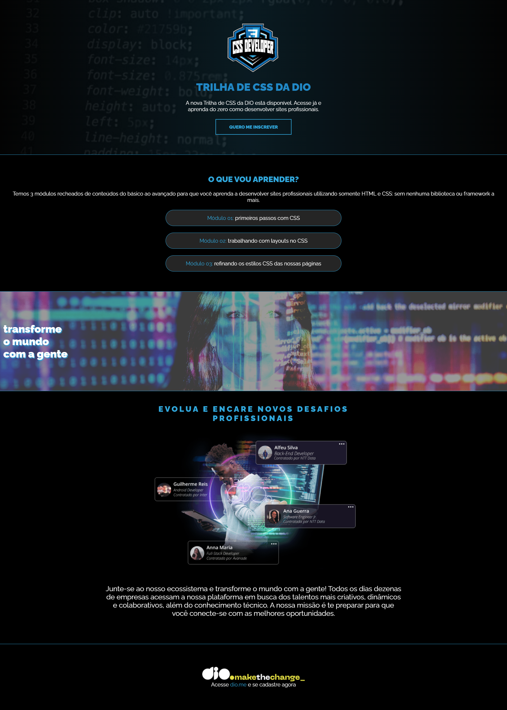

# CSS DEVELOPER - DIO

Este projeto foi desenvolvido como um desafio da platforma DIO de aprendizado de css! Foi disponibilizado um protótipo no figma e era necessário clonar com o css o visual do protótipo.
 

# **📈 OBJETIVO:**
### 📚 Aprendizado
### 🧠 Conhecimento
### ⭐ Sucesso
 

# **🛠 LINGUAGENS UTILIZADAS:**

  

